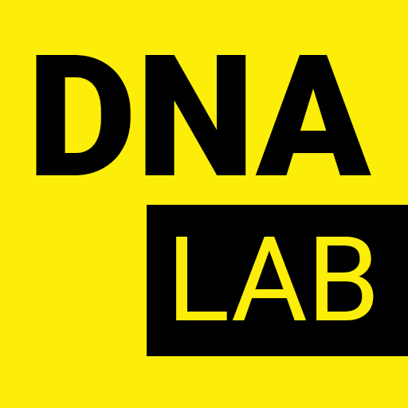
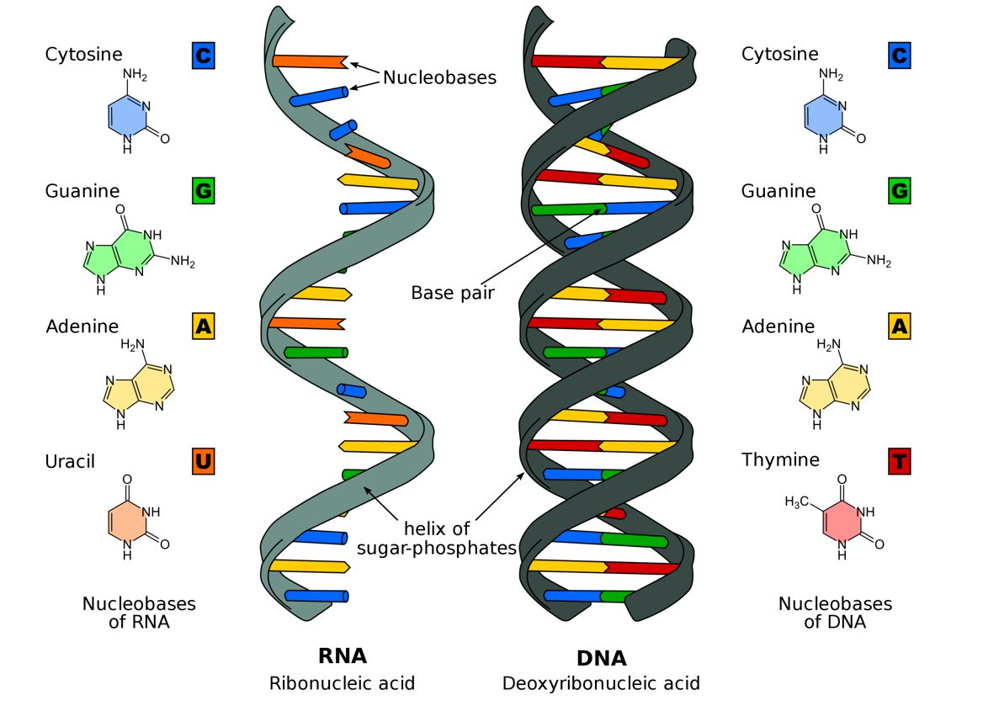
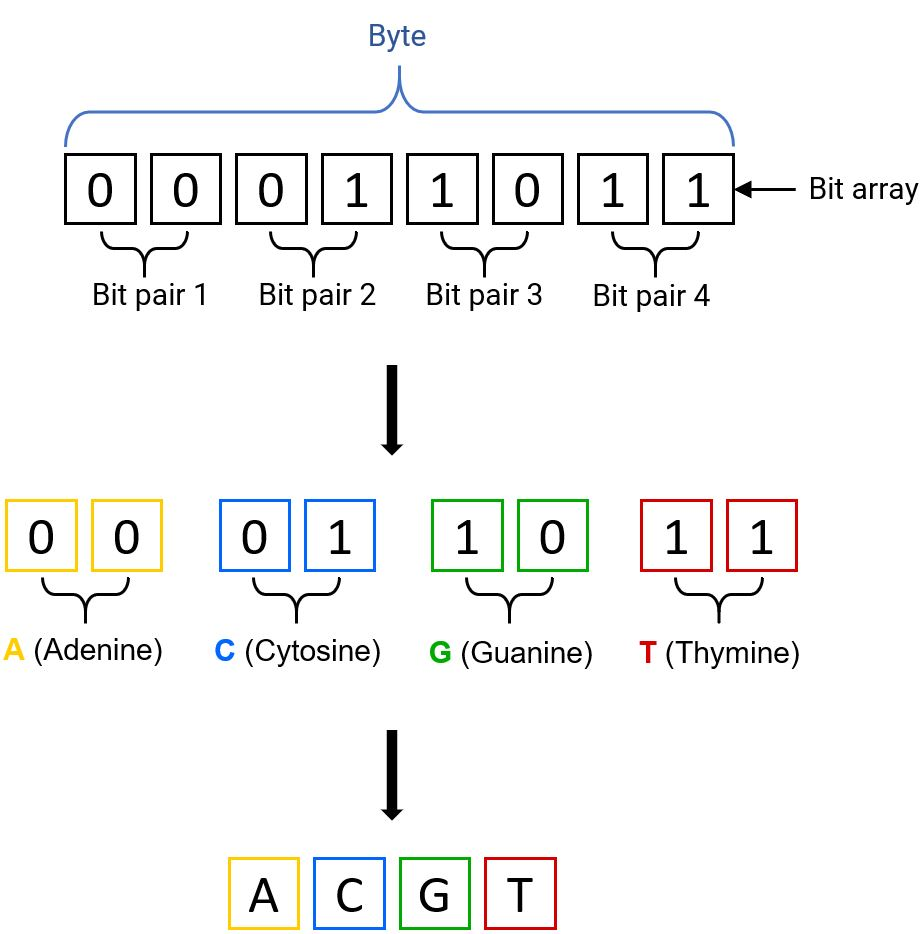

# DNK Laboratory

The .NET Standard Library for encoding/decoding data into DNA sequence.

## Overview

This projects contains implementation of DNA encoding and decoding algorithms which will help you to encode binary data into DNA sequence.

## Installetion
[](...)

You can install the last stable version of **DNK Laboratory** using nuget.
```
PM> ...
```
For more details about package please visit [this](...).

## Encode binary data into DNA sequence
Any digital data can be represented as array of bytes.
in a byte, each bit located from right to left represents a values from 0 (00000000) to 255 (11111111) [1].

However in an array, (matrix 1 x N) values located from left to right [2][3].

Lets split array by '**bit pairs**' from left to right, this how we get 4 pairs of bits. Each pair can be in one of 4 possible values: (00), (01), (10), and (11).
Each of this state can be represented as **DNA nucleotide**.
A Nucleotide in DNA consists of a sugar (deoxyribose), one of four bases (cytosine (C), thymine (T), adenine (A), guanine (G)), and a phosphate [4].



This means that any information streamed as an array of bytes, where each byte (eight-bit array), can be represented as a sequence of two base pairs of nucleotides.



## References
* [1] - [Byte](https://en.wikipedia.org/wiki/Byte)
* [2] - [Array](https://docs.microsoft.com/en-us/dotnet/api/system.array?view=netcore-3.1)
* [3] - [Matrix](https://en.wikipedia.org/wiki/Matrix_mathematics)
* [4] - [Nucleotide](https://en.wikipedia.org/wiki/Nucleotide)
