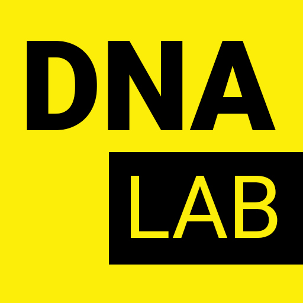
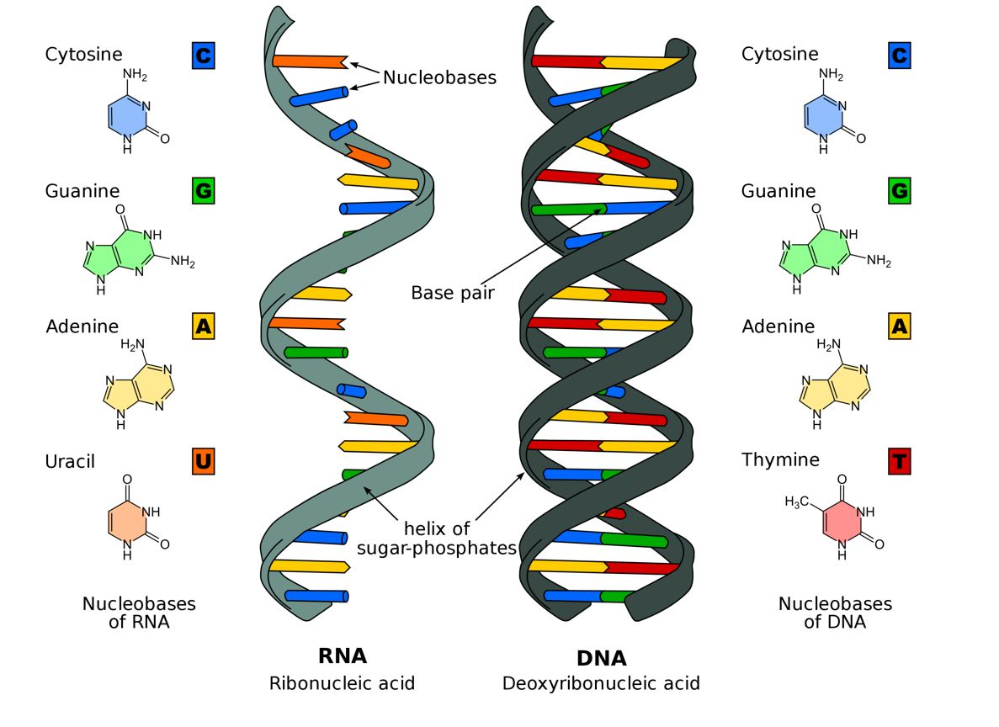
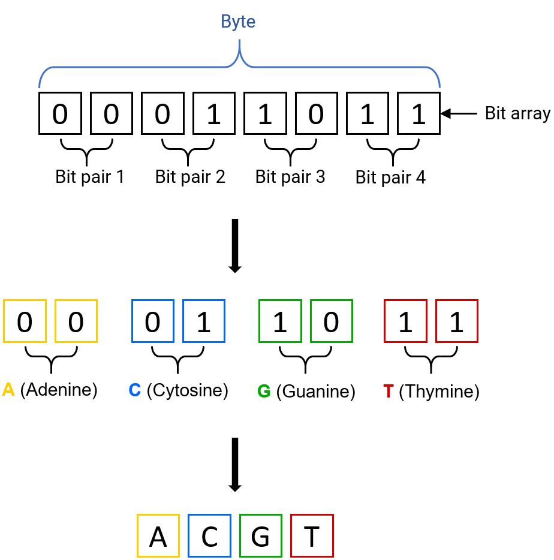

# DNA Laboratory

A modern and lightweight **.NET library** for encoding and decoding digital data into **DNA sequences**, inspired by biological information storage. The package targets **.NET 10** (`net10.0`).



---

## Legal Notice

All source code and opinions expressed in this repository are solely my own and do not represent the views, policies, or endorsements of my employer. This project is not commercially funded, not affiliated with any organization, and was developed entirely in my personal time with the intention of supporting learning, research, and the open-source community.

---

## Overview

**DNA Laboratory** provides a practical implementation of DNA-based information encoding concepts.  
It allows binary digital data to be converted into DNA nucleotide representations — and enables decoding back to binary when required.

This library can serve as:

- A learning tool for understanding DNA data encoding concepts.
- A proof-of-concept for DNA-based digital storage approaches.
- A lightweight utility for experimenting with bio-inspired information systems.

---

## Requirements

- **.NET 10** or later for applications and libraries that reference this package (the NuGet asset targets `net10.0`).
- **SDK:** [.NET 10 SDK](https://dotnet.microsoft.com/download/dotnet/10.0) to build the solution from source. The repository includes [`global.json`](./src/Dot%20Net/DNALab/global.json) to pin a compatible SDK version.

---

## Installation

[](https://www.nuget.org/packages/DNALab)

Install the latest version via **NuGet Package Manager**:

```cmd
PM> Install-Package DNALab -Version 0.0.6-alpha
```

More details are available on the NuGet package page:  
https://www.nuget.org/packages/DNALab

---

## Encoding Binary Data into DNA Sequences

Any digital data can be represented as an array of bytes.  
Each byte consists of 8 bits, representing values in the range `0` (00000000) to `255` (11111111) [1].

In a byte array (1 × N matrix), values are processed from left to right [2][3].

To perform encoding:

1. Each byte is split into **four bit-pairs** (00, 01, 10, 11).
2. Each pair is mapped to a specific **DNA nucleotide**.
3. The result is a sequence composed of the four nucleotides: **A, T, C, G**.

A DNA nucleotide consists of:

- a sugar molecule (deoxyribose),
- a phosphate group,
- one of four bases: **adenine (A), thymine (T), cytosine (C), or guanine (G)** [4].



This makes it possible to represent ordinary digital data using biological-style encoding, translating bits into nucleotide sequences.



---

## References

- **[1] Byte — Digital Information Unit**  
  Explanation of what a byte is, how it represents digital information, and its role in computing.  
  https://en.wikipedia.org/wiki/Byte

- **[2] Array in .NET**  
  Official Microsoft documentation describing arrays, data layout, indexing, and their use in .NET applications.  
  https://learn.microsoft.com/dotnet/api/system.array

- **[3] Matrix Representation Concepts**  
  Mathematical background of matrices, their structure, and relevance to ordered data representation.  
  https://en.wikipedia.org/wiki/Matrix_mathematics

- **[4] Nucleotide — The Foundation of DNA**  
  Detailed description of nucleotides, their structure, biological purpose, and their role in DNA encoding — which inspired this project.  
  https://en.wikipedia.org/wiki/Nucleotide

---
